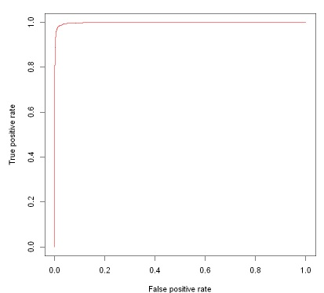

# Portfólio

---

## Classificação

### Prevendo o Status de Extinção de Chamas de Combustível por Ondas Sonoras em R
 Este projeto tem como objetivo principal criar um modelo de Machine Learning capaz de prever se uma chama será extinta ao empregar um sistema de extinção por ondas sonoras, com base em simulações computacionais. 

Os incêndios, provenientes de diversas causas, são considerados desastres naturais, e a busca por abordagens mais ecológicas e inovadoras para seu controle tem sido uma prioridade. No âmbito dessa pesquisa, um sistema de extinção de incêndios baseado em ondas sonoras foi concebido e está passando por testes para avaliar sua eficácia no combate aos incêndios. 

Assim, utilizando dados reais disponíveis publicamente iremos desenolver um modelo em Machine Learning, nosso objetivo é desenvolver um modelo de Machine Learning capaz de prever a eficácia de um sistema de extinção de incêndios por ondas sonoras. Para alcançar esse objetivo, utilizamos quatro algoritmos: **o GLM (General Linear Model), Naive Bayes, Random Forest e Árvores de Decisão C50, incluindo uma versão com função de custo**. Notavelmente, as Árvores de Decisão C50 se destacaram, apresentando um desempenho superior, com uma acurácia superior a 0.98. 

O dataset original pode ser acessado clicando [aqui](https://www.muratkoklu.com/datasets/vtdhnd07.php) 

[

Para ilustrar a sensibilidade e especificidade do modelo, apresentamos abaixo a imagem da curva ROC.

### Avaliação de Risco de Crédito em linguagem R
Este projeto tem como objetivo desenvolver um modelo preditivo destinado a classificar o risco de concessão de crédito para os clientes de uma instituição bancária. O objetivo principal é aprimorar a tomada de decisões relacionadas à concessão de crédito por meio da implementação de um modelo que avalie de forma precisa e eficiente o risco associado a cada cliente. 

O conjunto de dados 'German Credit Data' será usado para construir e treinar o modelo, neste experimento. Este dataset é baseado em dados reais gerados por um pesquisador da Universidade de Hamburgo, na Alemanha.  

Para o treinamento do modelo, utilizamos três algoritmos: o **GLM (General Linear Model), Naive Bayes e Random Forest**. Previamente, empregamos técnicas de balanceamento de dados, como SMOTE e ROSE, com o intuito de aprimorar o desempenho do modelo diante de desequilíbrios na distribuição dos dados.  

O dataset original pode ser acessado clicando [aqui](https://archive.ics.uci.edu/dataset/144/statlog+german+credit+data) 

Imagem da curva ROC que ilustra o desempenho do modelo de classificação binária:

---

## Regressão

### Prevendo o Consumo de Energia de Carros Elétricos em linguagem R

 O projeto Prevendo o Consumo de Energia de Carros Elétricos tem como propósito desenvolver um modelo de Machine Learning capaz de prever o consumo de energia de carros elétricos. 

Na construção do modelo, empregou-se a biblioteca **RandomForest** para avaliar a importância das variáveis. Ao final desse processo, optou-se pela utilização do **modelo de regressão** linear para a criação do modelo final. 

Já a avaliação de desempenho do modelo de regressão inclui a análise de métricas fundamentais, como o **Erro Quadrático Médio (MSE)**, a **Raiz do Erro Quadrático Médio (RMSE)** e o **Coeficiente de Determinação (R²)**. Além disso, são realizadas verificações adicionais, como a avaliação da **homocedasticidade** para assegurar a constância da variância dos resíduos ao longo dos valores preditos, assim como a verificação da **normalidade** dos resíduos.

A base de dados  é composta por 53 carros elétricos e pode ser acessada clicando [aqui](https://data.mendeley.com/datasets/tb9yrptydn/2)

Abaixo apresenta-se o Gráfico de Resíduos versus Valores Ajustados, auxiliando na verificação da suposição de homocedasticidade, juntamente com um histograma para avaliação da normalidade dos resíduos:

---

## Mini projetos

- [Mini projeto 1 - Resumo Estatístico em R](https://github.com/leticiadluz/estatistica_com_R/blob/main/Resumo_Estatistica_R_Jupyter.ipynb)
- [Mini projeto 2 - Testes de Hipóteses em R](https://github.com/leticiadluz/estatistica_com_R/blob/main/Teste_Hipotese.ipynb)
- [Mini proejeto 3 - Análise de Variância (ANOVA) em R ](https://github.com/leticiadluz/estatistica_com_R/blob/main/Anova_R.ipynb)
- [Mini projeto 4 - AED em Dados Categóricos e Teste Qui-Quadrado em R](https://github.com/leticiadluz/AED_categoricos-qui_quadrado_R/blob/main/AED_Categoricos.ipynb)

---
© 2024 Leticia da Luz. Desenvolvido por Jekyll e the Minimal Theme.
