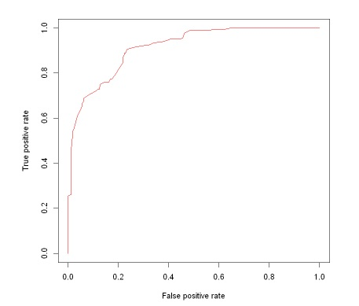

# Portfólio

---

## Classificação

### Avaliação de Risco de Crédito
Este projeto tem como objetivo desenvolver um modelo preditivo destinado a classificar o risco de concessão de crédito para os clientes de uma instituição bancária. O objetivo principal é aprimorar a tomada de decisões relacionadas à concessão de crédito por meio da implementação de um modelo que avalie de forma precisa e eficiente o risco associado a cada cliente.  

O conjunto de dados 'German Credit Data' será usado para construir e treinar o modelo, neste experimento. Este dataset é baseado em dados reais gerados por um pesquisador da Universidade de Hamburgo, na Alemanha.  

Para o treinamento do modelo, utilizamos três algoritmos: o **GLM (General Linear Model), Naive Bayes e Random Forest**. Previamente, empregamos técnicas de balanceamento de dados, como SMOTE e ROSE, com o intuito de aprimorar o desempenho do modelo diante de desequilíbrios na distribuição dos dados.  

O dataset original pode ser acessado clicando [aqui](https://archive.ics.uci.edu/dataset/144/statlog+german+credit+data) 

---
[Project 2 Title](/pdf/sample_presentation.pdf)

---
[Project 3 Title](http://example.com/)

---

### Category Name 2

- [Project 1 Title](http://example.com/)
- [Project 2 Title](http://example.com/)
- [Project 3 Title](http://example.com/)
- [Project 4 Title](http://example.com/)
- [Project 5 Title](http://example.com/)

---

---

Page template forked from <a href="https://github.com/evanca/quick-portfolio">evanca</a>

<!-- Remove above link if you don't want to attibute -->
